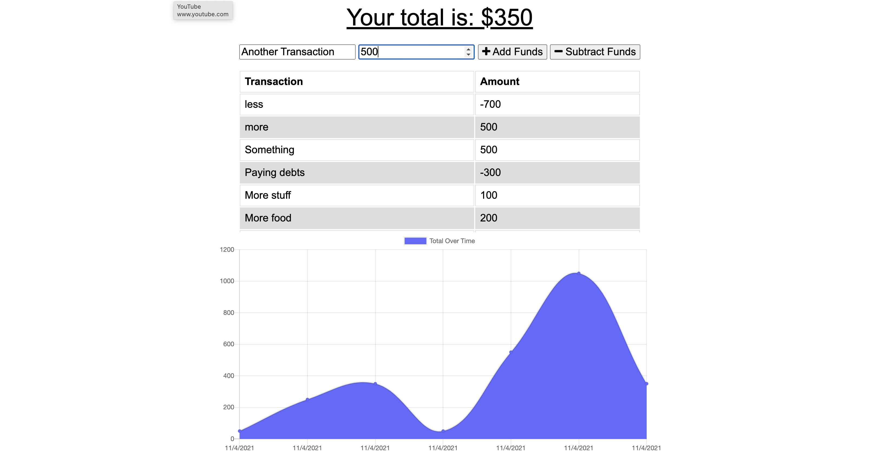

# budget-tracker

## Description
This is an app designed to add and subtract funds from a budget. It has both online and offline functionality. Additionally, as a PWA, it can be downloaded. 

## Table of Contents 
- [Installation](#installation)
- [Usage](#usage)
- [License](#license)
- [Contributing](#contributing)
- [Tests](#tests)
- [Questions](#questions)

## Installation
The project can be installed here: https://github.com/jfisher37/budget-tracker

## Usage
The project is deployed here: https://budget-tracker-jfisher37.herokuapp.com/

To use it, just enter a transaction name and amount, and then choose to either add or subtract from your budget. 

## License
This project is covered by a MIT license.

## Contributing
If you want to make contributions, please refer to the following instructions:

If you'd like to make contributions to the project, please refer to the contact info in the Questions section below.

## Tests
If you'd like to test the project, please refer to the contact info in the Questions section below.

## Questions
Please refer to the below contact information for any questions:

Github Profile - jfisher37

Github Profile Link - https://github.com/jfisher37

Email - joseph.eric.fisher@Gmail.com

